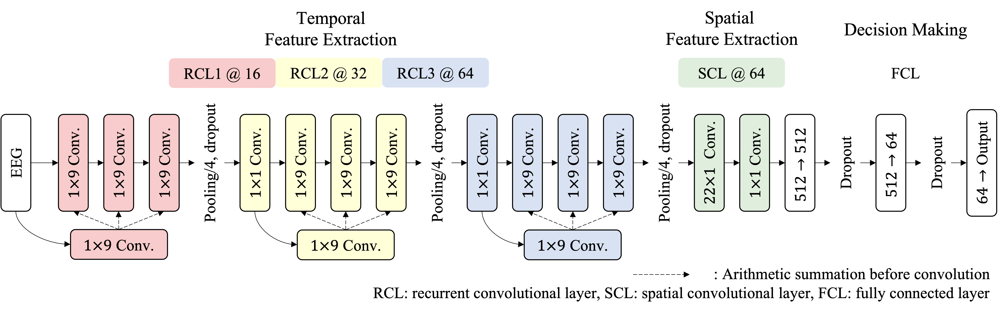

## Deep Recurrent Spatio-Temporal Neural Network for Motor Imagery based BCI
<p align="center"></p>

This repository provides a TensorFlow implementation of the following paper:
> **Deep Recurrent Spatio-Temporal Neural Network for Motor Imagery based BCI**<br>
> [Wonjun Ko](https://scholar.google.com/citations?user=Fvzg1_sAAAAJ&hl=ko&oi=ao)<sup>1</sup>, [Jee Seok Yoon](https://scholar.google.com/citations?user=YjaJ5qQAAAAJ&hl=ko)<sup>1</sup>, Eunsong Kang<sup>1</sup>, [Eunji Jun](https://scholar.google.com/citations?user=uR6W4TUAAAAJ&hl=ko)<sup>1</sup>, [Jun-Sik Choi](https://scholar.google.com/citations?user=DYTtTzQAAAAJ&hl=ko)<sup>1</sup>, [Heung-Il Suk](https://scholar.google.co.kr/citations?user=dl_oZLwAAAAJ&hl=ko)<sup>1, 2</sup><br/>
> (<sup>1</sup>Department of Brain and Cognitive Engineering, Korea University) <br/>
> (<sup>2</sup>Department of Artificial Intelligence, Korea University) <br/>
> Official Version: https://ieeexplore.ieee.org/abstract/document/8311535 <br/>
> Presented in the 6th IEEE International Winter Conference on Brain-Computer Interface (BCI)
> 
> **Abstract:** *In this paper, we propose a novel architecture of a deep neural network for EEG-based motor imagery classification. Unlike the existing deep neural networks in the literature, the proposed network allows us to analyze the learned network weights from a neurophysiological perspective, thus providing an insight into the underlying patterns inherent in motor imagery induced EEG signals. In order to validate the effectiveness of the proposed method, we conducted experiments on the BCI Competition IV-IIa dataset by comparing with the competing methods in terms of the Cohen’s κ value. For qualitative analysis, we also performed visual inspection of the activation patterns estimated from the learned network weights.*

## Dependencies
* [Python 3.6+](https://www.continuum.io/downloads)
* [TensorFlow 1.5.0+](https://www.tensorflow.org/)

## Downloading datasets
To download BCI Competition IV-2A dataset
* https://www.bbci.de/competition/iv/

## Usage
`network.py` contains the proposed deep learning architectures, `utils.py` contains functions used for experimental procedures, and `experiment.py` contains the main experimental functions.

## Citation
If you find this work useful for your research, please cite our [paper](https://ieeexplore.ieee.org/abstract/document/9061668):
```
@inproceedings{ko2018deep,
  title={Deep recurrent spatio-temporal neural network for motor imagery based {BCI}},
  author={Ko, Wonjun and Yoon, Jeeseok and Kang, Eunsong and Jun, Eunji and Choi, Jun-Sik and Suk, Heung-Il},
  booktitle={2018 6th International Conference on Brain-Computer Interface (BCI)},
  pages={1--3},
  year={2018},
  organization={IEEE}
}
```

## Acknowledgements
This work was supported by the Institute of Information & Communications Technology Planning & Evaluation (IITP) grant funded by the Korea government (No. 2017-0-00451; Development of BCI based Brain and Cognitive Computing Technology for Recognizing User’s Intentions using Deep Learning).
